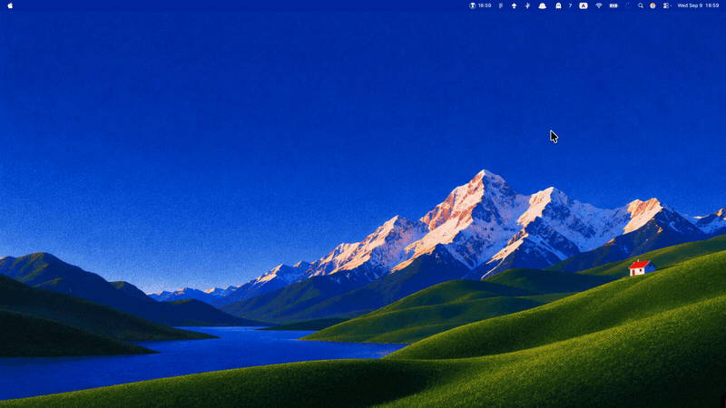
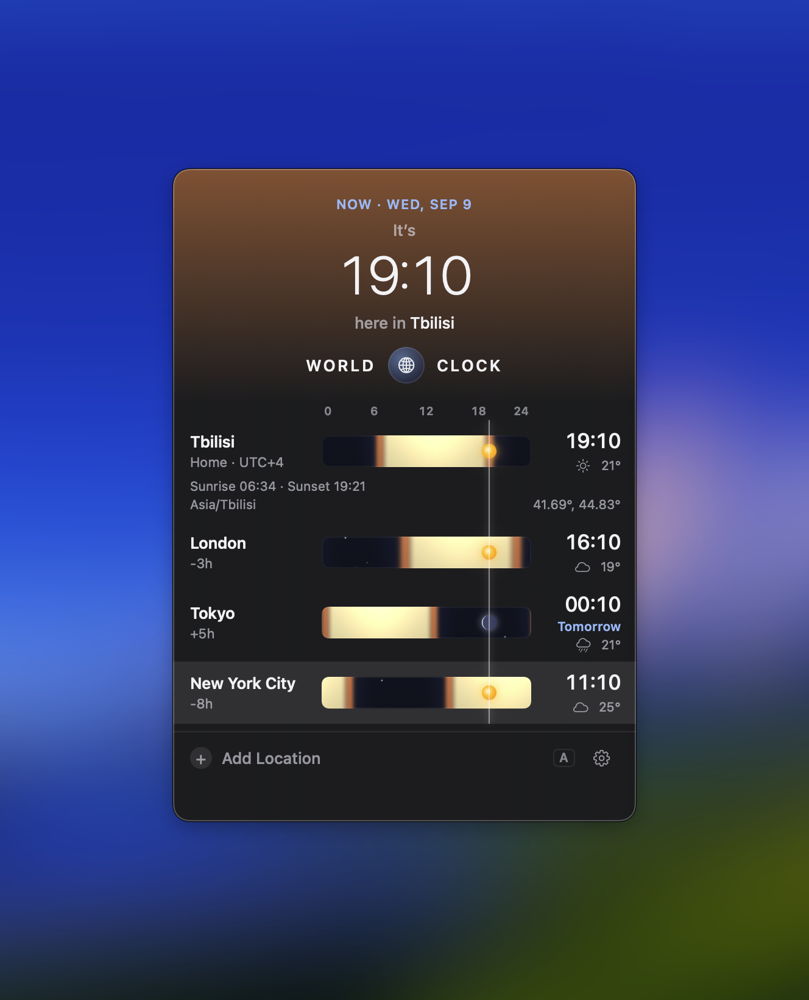
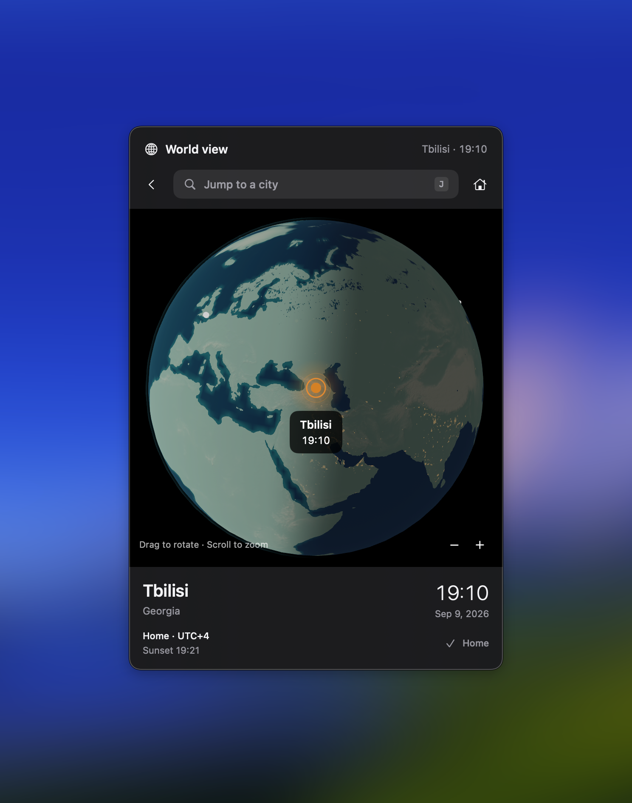

<h1 align="center">WorldClock</h1>

<h3 align="center">Time zones at a glance, right from your Mac’s menu bar.</h3>

<p align="center">
  macOS 15+ · Apple Silicon &amp; Intel · <a href="LICENSE">MIT License</a>
</p>

## Showcase

<p align="center">
  <a href="docs/media/worldclock-demo.mp4">
    
  </a>
</p>

<br />

<p align="center">
  
  &nbsp;&nbsp;
  
</p>

## Install

With Homebrew:

```sh
brew tap tornikegomareli/worldclock https://github.com/tornikegomareli/worldclock-macos
brew install --cask tornikegomareli/worldclock/worldclock
```

Or download [WorldClock.dmg](https://github.com/tornikegomareli/worldclock-macos/releases/latest/download/WorldClock.dmg).
The app is signed and notarized for macOS 15+, on Apple Silicon and Intel.

## Using it

- Press **⌥ Space** to open your clocks.
- Add cities and compare their local times.
- Drag the timeline to find a time that works.
- Open world view and pick a city to fly there.

## Build from source

You can build with Xcode, Swift 6, and [mise](https://mise.jdx.dev/).

```sh
git clone https://github.com/tornikegomareli/worldclock-macos.git
cd worldclock-macos
mise install
tuist install
tuist generate
```

Run the `WorldClock` scheme in Xcode.

To run tests:

```sh
xcodebuild test -workspace WorldClock.xcworkspace -scheme WorldClock -destination 'platform=macOS'
```

Source builds work without an Apple Developer account. Weather needs a WeatherKit signing profile. Update checks are disabled in source builds.

## Privacy

No accounts or analytics. Your cities and preferences stay on your Mac.
Clocks, city search, and the globe work offline. Optional weather connects to Apple; release update checks connect to GitHub.

Read the [privacy details](PRIVACY.md).

## License

WorldClock is free and open source under the [MIT License](LICENSE).

City data is from GeoNames (CC BY 4.0). Earth imagery is from NASA and GEBCO. Weather is provided by Apple Weather.
See [credits and third-party licenses](THIRD_PARTY_NOTICES.md) for sources and notices.
